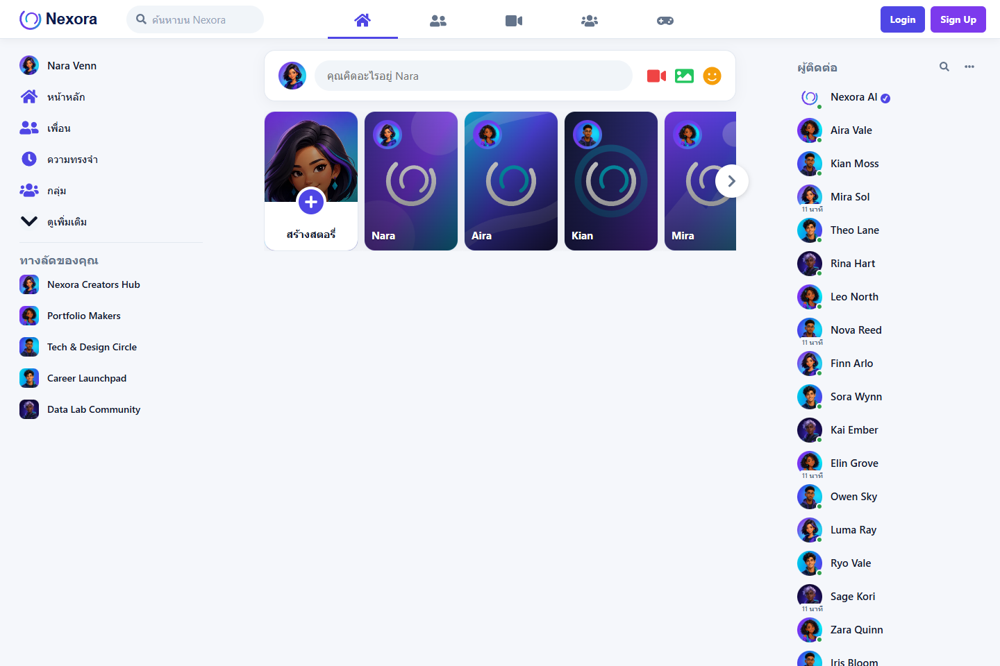
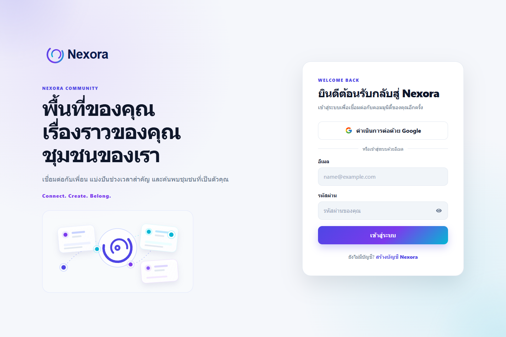
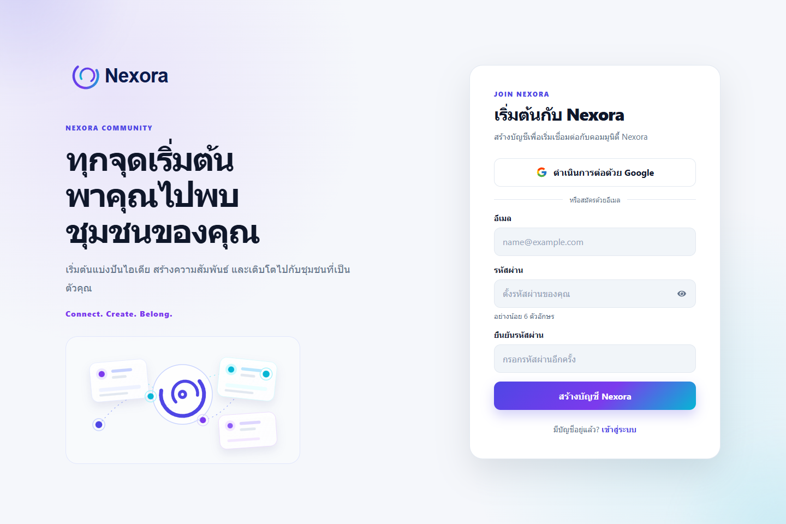

# Nexora Social Community

Nexora คือเว็บ Social Community สำหรับทดลองแนวคิดการเชื่อมต่อผู้คน การแบ่งปันเรื่องราว และการสร้างชุมชนออนไลน์ หน้าตาและรูปแบบการใช้งานได้รับแรงบันดาลใจจากแพลตฟอร์ม social feed แต่ได้รับการออกแบบแบรนด์และข้อมูลเดโมใหม่เป็น Nexora โดยไม่มีความเกี่ยวข้องกับ Facebook หรือ Meta

โปรเจกต์นี้เป็นผลงานจากรายวิชา **การพัฒนาซอฟต์แวร์ด้วยเทคโนโลยี Front-End** — ทล.บ 1/1 2569

ผู้พัฒนา: **Jirawat Donbantao**

## สถานะการพัฒนา

**สถานะโดยรวม: พร้อมเผยแพร่เป็นผลงาน Portfolio และ source code บน GitHub แต่ยังไม่ใช่บริการ Social Community ที่พร้อมใช้งานจริงในระดับ production**

### สิ่งที่พัฒนาแล้ว

| ส่วนงาน | สถานะ | รายละเอียด |
| --- | --- | --- |
| แบรนด์และหน้าตา Nexora | เสร็จแล้ว | มีโลโก้ Loop, design token, responsive layout และหน้า Login/Signup ในธีม Aurora |
| หน้า Home และ Feed | เสร็จแล้ว | แสดง Feed, Stories, Sidebar, Contacts และค้นหาโพสต์/ผู้ติดต่อจากข้อมูลเดโม |
| การมีส่วนร่วมกับโพสต์ | เสร็จแล้ว | สร้าง/ลบ/แชร์โพสต์แบบเดโม, Reaction, Comment, Reply และอัปโหลดรูปพร้อมตรวจชนิดไฟล์/ขนาด |
| Authentication | เสร็จแล้วในโค้ด | รองรับ Email/Password และ Google Sign-In ผ่าน Firebase เมื่อผู้ใช้ตั้งค่า `.env`, provider และ Authorized domains ครบ |
| การเข้าถึงและการใช้งาน | เสร็จแล้ว | รองรับ keyboard, focus state, dialog focus management, Escape และการใช้งานบน Desktop/Tablet/Mobile |
| คุณภาพโค้ด | ผ่านการตรวจ | ตรวจ lint, unit tests 21 รายการ, build, browser E2E และ dependency audit แล้วผ่านก่อนเผยแพร่ |
| เอกสารและภาพตัวอย่าง | เสร็จแล้ว | มี README, เอกสารเชิงลึก 7 ไฟล์ และภาพหน้าจอประกอบใน `document/` |

### สิ่งที่ยังไม่พัฒนา

- **ฐานข้อมูลถาวร:** ยังไม่มี Firebase Firestore หรือ Realtime Database ดังนั้นโพสต์, ความคิดเห็น, Reaction และ Story ที่สร้างระหว่างใช้งานจะหายเมื่อรีเฟรชหน้า
- **พื้นที่เก็บรูปภาพ:** ยังไม่มี Firebase Storage; รูปที่ผู้ใช้เลือกใช้ได้เฉพาะใน browser session ปัจจุบัน
- **หน้ารายละเอียดโพสต์และ Copy Link:** ยังไม่มี URL เช่น `/posts/:id` ปุ่ม Copy Link จึงแสดงข้อความว่าเป็นฟีเจอร์เดโม
- **ฟีเจอร์ชุมชนจริง:** Messenger, Notification, เมนูตัวเลือกโพสต์, กลุ่ม, รายชื่อผู้ติดต่อ และเมนู Sidebar หลายส่วนเป็นข้อมูล/ปุ่มเดโม ยังไม่มี backend รองรับ
- **การจัดการบัญชี:** ยังไม่มีลืมรหัสผ่าน, ยืนยันอีเมล, แก้ไขโปรไฟล์, ลบบัญชี หรือจัดการสิทธิ์ผู้ใช้
- **ความปลอดภัยระดับบริการ:** ยังไม่มีระบบรายงานเนื้อหา, moderation, rate limiting ฝั่ง server, audit log หรือกฎฐานข้อมูล/Storage เพราะยังไม่มี backend ในโครงการนี้
- **การเผยแพร่ระบบ:** ยังไม่ได้ deploy, ตั้งโดเมนจริง, ตั้งค่า environment variables บนโฮสต์ หรือทำ CI/CD
- **เอกสารสำหรับผู้ใช้จริง:** ยังไม่มีหน้า Terms of Service และ Privacy Policy เนื่องจากยังเป็นโครงการเพื่อการเรียนรู้และ Portfolio

### ลำดับการต่อยอดที่แนะนำ

1. Deploy เว็บและเพิ่มโดเมนจริงใน Firebase Authorized domains พร้อมตั้งค่า environment variables บนโฮสต์
2. เพิ่ม Firestore และกำหนด Security Rules ก่อนบันทึกโพสต์/คอมเมนต์/โปรไฟล์จริง
3. เพิ่ม Firebase Storage พร้อม rules และการย่อ/ตรวจรูปภาพบน server ก่อนเปิดให้ผู้ใช้หลายคนอัปโหลด
4. สร้างหน้าโปรไฟล์, reset password, email verification และหน้ารายละเอียดโพสต์
5. เพิ่ม Terms, Privacy, reporting/moderation และการทดสอบ CI ก่อนเปิดใช้งานสาธารณะ

## เว็บนี้ทำอะไรได้บ้าง

- อ่านและค้นหาโพสต์ในหน้า Home
- สร้างโพสต์ข้อความหรือแนบรูปภาพจากเครื่อง
- กด Reaction, แสดงความคิดเห็น, ตอบกลับ และแชร์โพสต์แบบเดโม
- สร้างและดู Stories
- ดูรายชื่อผู้ติดต่อ กลุ่มสนทนา และทางลัดชุมชนจากข้อมูลเดโม
- สมัครสมาชิกและเข้าสู่ระบบด้วย Email/Password หรือ Google ผ่าน Firebase Authentication
- ใช้งานได้ทั้ง Desktop, Tablet และ Mobile

> ข้อมูลโพสต์ คอมเมนต์ และ Story ที่สร้างในหน้าเว็บเก็บอยู่ในหน่วยความจำของ browser เพื่อการสาธิต จึงหายเมื่อรีเฟรชหน้า ส่วนสถานะเข้าสู่ระบบจัดการโดย Firebase Authentication

## หน้าหลัก

| หน้า | ที่อยู่ | หน้าที่ |
| --- | --- | --- |
| Home | `/` | Feed, Stories, การสร้างโพสต์, ค้นหา และผู้ติดต่อ |
| Login | `/login` | เข้าสู่ระบบด้วย Email/Password หรือ Google |
| Signup | `/signup` | สร้างบัญชีด้วย Email/Password หรือ Google |

## ภาพตัวอย่าง

| Home | Login | Signup |
| --- | --- | --- |
|  |  |  |

ภาพเพิ่มเติม รวมถึง Mobile และหน้าต่างฟีเจอร์ต่าง ๆ อยู่ที่ [document/screenshots](document/screenshots/)

## เทคโนโลยี ไลบรารี และเครื่องมือ

### ไลบรารีที่ใช้ขณะรันเว็บ

| Package | หน้าที่ |
| --- | --- |
| `react` และ `react-dom` | สร้างและแสดงผลส่วนติดต่อผู้ใช้ด้วย React 19 |
| `react-router-dom` | จัดการเส้นทาง `/`, `/login` และ `/signup` |
| `firebase` | เชื่อม Firebase Authentication สำหรับ Email/Password และ Google Sign-In |
| `react-icons` | แสดงไอคอนของเมนู ปุ่ม และปฏิสัมพันธ์ในหน้าเว็บ |
| `prop-types` | ตรวจรูปแบบ props ของ React component ระหว่างพัฒนา |

### เครื่องมือสำหรับพัฒนาและตรวจคุณภาพ

| เครื่องมือ / Package | หน้าที่ |
| --- | --- |
| `vite` และ `@vitejs/plugin-react` | เปิด development server และ build ไฟล์สำหรับ production |
| `eslint`, `eslint-plugin-react-hooks`, `eslint-plugin-react-refresh` | ตรวจรูปแบบโค้ดและข้อผิดพลาดทั่วไปของ React |
| `vitest`, `jsdom`, `@testing-library/react`, `@testing-library/user-event`, `@testing-library/jest-dom` | ทดสอบ component และพฤติกรรมผู้ใช้แบบ unit test |
| `@playwright/test` | ทดสอบหน้าเว็บจริงบน browser รวมถึง responsive layout และ flow สำคัญ |
| Firebase Console | เปิดผู้ให้บริการ Email/Password และ Google รวมถึงตั้ง Authorized domains |
| Git และ GitHub | จัดการเวอร์ชันของโค้ดและเผยแพร่ source code ของโปรเจกต์ |

รายชื่อและเวอร์ชันที่ใช้จริงอยู่ใน [package.json](package.json) และ `package-lock.json` จะล็อกเวอร์ชันที่ติดตั้งเพื่อให้เครื่องอื่นติดตั้งได้ใกล้เคียงกัน

## เริ่มใช้งานบนเครื่อง

ต้องมี Node.js รุ่นปัจจุบันและ npm ก่อน จากนั้นรันคำสั่งต่อไปนี้ในโฟลเดอร์โปรเจกต์

```bash
npm install
copy .env.example .env
npm run dev
```

`npm install` จะติดตั้งทุกไลบรารีจาก `package.json` ตามเวอร์ชันใน `package-lock.json` จึงไม่จำเป็นต้องติดตั้ง React, Firebase หรือเครื่องมือทดสอบทีละตัว

เปิด URL ที่ Vite แสดงใน terminal โดยปกติคือ `http://localhost:5173`

ก่อนใช้ Firebase ให้ตั้งค่า `VITE_FIREBASE_*` ใน `.env` ตาม [คู่มือ Firebase](FIREBASE_SETUP.md) ห้ามนำ `.env` ขึ้น GitHub

คำสั่งสำคัญ:

```bash
npm run dev          # เปิดโหมดพัฒนา
npm run build        # สร้างไฟล์ production ใน dist/
npm run lint         # ตรวจรูปแบบและข้อผิดพลาดของโค้ด
npm run test         # รัน unit tests
npm run test:e2e     # รัน browser tests
npm run test:verify  # ตรวจครบ lint + test + build + e2e
```

## โครงสร้างโดยย่อ

```text
src/
  components/  ส่วนประกอบของหน้าจอและฟอร์ม
  pages/       หน้า Home และ state ของ Feed
  context/     สถานะ Firebase Authentication
  data/        รายชื่อ รูป และข้อมูลเดโม
  hooks/       พฤติกรรมที่ใช้ซ้ำ เช่น dialog และ reaction
  styles/      CSS แยกตามส่วนของ UI
  assets/      โลโก้ SVG, avatar, story และ reaction GIF
document/      คู่มือเชิงลึกและภาพหน้าจอ
e2e/           Playwright browser tests
```

## เอกสารเชิงลึก

1. [ภาพรวมโปรเจกต์](document/01-project-overview.md)
2. [เริ่มต้นและรันโปรเจกต์](document/02-getting-started.md)
3. [สถาปัตยกรรมและเส้นทาง](document/03-architecture-and-routes.md)
4. [ฟีเจอร์และคู่มือผู้ใช้](document/04-features-and-user-guide.md)
5. [Authentication และความปลอดภัย](document/05-authentication-and-security.md)
6. [ดีไซน์, Asset และ Style](document/06-design-assets-and-styles.md)
7. [สารบัญอ้างอิงไฟล์ต้นฉบับ](document/07-source-file-reference.md)
8. [สารบัญภาพประกอบโครงการ (PDF)](document/Nexora-Image-Catalog.pdf)

## ขอบเขตของ Demo

- ยังไม่มี Firebase Database หรือ Storage ดังนั้นโพสต์/รูปที่ผู้ใช้สร้างไม่ถูกบันทึกถาวร
- ปุ่ม Copy Link แจ้งว่าเป็นฟีเจอร์เดโม เพราะยังไม่มี URL รายโพสต์
- ปุ่มเมนูที่ยังไม่มีฟีเจอร์รองรับจะแสดงสถานะ Demo แทนการทำงานหลอกผู้ใช้
- การทดสอบ Google Sign-In จริงควรใช้บัญชีที่ผู้พัฒนาควบคุมเอง
