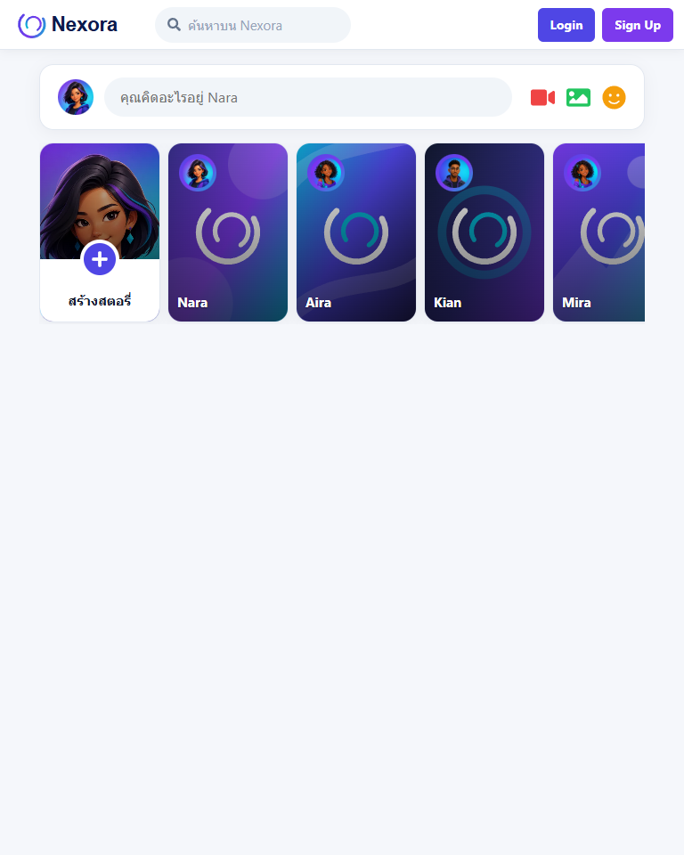
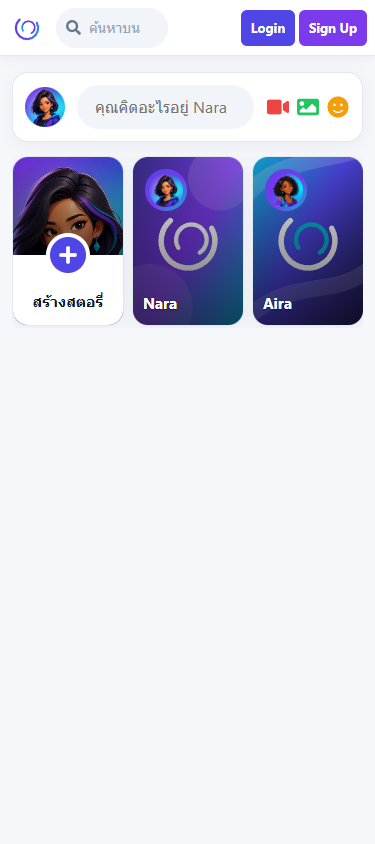

# 1. ภาพรวม Nexora Social Community

## Nexora คืออะไร

Nexora เป็นเว็บ Social Community แบบ Front-End ที่จำลองประสบการณ์สำคัญของแพลตฟอร์ม social feed ได้แก่ การสร้างโพสต์ การมีปฏิสัมพันธ์กับโพสต์ Stories รายชื่อผู้ติดต่อ และการเข้าสู่ระบบ จุดประสงค์คือเรียนรู้การออกแบบ UI, การจัดการ state ใน React, การแบ่ง component, responsive design และการเชื่อมต่อ Firebase Authentication

โปรเจกต์ใช้ชื่อ สี โลโก้ ข้อมูลรายชื่อ และรูปเดโมของ Nexora ทั้งหมด ไม่ใช่ผลิตภัณฑ์ Facebook และไม่มีความเกี่ยวข้องกับ Meta

## เป้าหมายการเรียนรู้

- สร้าง Single-page application ด้วย React และ Vite
- แยก UI ออกเป็น component ที่ดูแลและทดสอบได้
- จัดการข้อมูลที่เปลี่ยนไป เช่น โพสต์ คอมเมนต์ Reaction และ Story
- สร้างระบบ Login/Signup ที่เชื่อม Firebase Authentication
- ออกแบบหน้าเว็บให้ใช้งานได้ในจอใหญ่ จอแท็บเล็ต และมือถือ
- ตรวจคุณภาพด้วย lint, unit tests และ browser tests

## เส้นทางของผู้ใช้

```text
เปิดเว็บ
  ├─ /          อ่าน Feed, สร้างโพสต์, Stories และค้นหา
  ├─ /login     เข้าสู่ระบบด้วย Email/Password หรือ Google
  └─ /signup    สร้างบัญชีด้วย Email/Password หรือ Google
```

หน้า Home เปิดดูได้แม้ยังไม่เข้าสู่ระบบ เพื่อรักษาขอบเขตของงานเดโม ส่วน Navbar จะเปลี่ยนตามสถานะ Firebase Authentication

## ส่วนประกอบที่ผู้ใช้มองเห็น

| ส่วน | สิ่งที่ทำได้ |
| --- | --- |
| Navbar | ค้นหาโพสต์ ผู้ติดต่อ และกลุ่มสนทนา; ไปหน้า Login/Signup; Logout เมื่อเข้าสู่ระบบ |
| Sidebar | แสดงโปรไฟล์เดโม เมนูชุมชน และทางลัด |
| Composer | สร้างโพสต์ข้อความหรือแนบไฟล์ภาพที่ผ่านการตรวจสอบ |
| Stories | ดู Story เดโม หรือสร้าง Story ข้อความ/รูปภาพใน session ปัจจุบัน |
| Feed | แสดงโพสต์ที่สร้างใน session; reaction, comment, reply, share และลบโพสต์ |
| Post Modal | อ่านโพสต์และคอมเมนต์ในหน้าต่าง dialog ที่รองรับคีย์บอร์ด |
| Contacts | ค้นหารายชื่อผู้ติดต่อและกลุ่มสนทนาจากข้อมูลเดโม |
| Auth Portal | หน้า Login/Signup ธีม Aurora พร้อมภาพ Nexora Community Constellation |

## ภาพหน้าจอ

| Desktop | Tablet | Mobile |
| --- | --- | --- |
|  |  |  |

## สิ่งที่เป็นข้อมูลเดโม

ข้อมูลต่อไปนี้มีไว้เพื่อแสดง UI และไม่ถูกส่งไปยัง database:

- ชื่อและ avatar ของ Nara Venn, ผู้ติดต่อ, กลุ่มสนทนา และทางลัด
- Stories เริ่มต้นและภาพประกอบ
- โพสต์ คอมเมนต์ คำตอบ Reaction และจำนวนการแชร์ที่สร้างขณะเปิดหน้าเว็บ

เมื่อรีเฟรชหน้า Home ข้อมูลเหล่านี้กลับสู่ค่าเริ่มต้น เพราะ state อยู่ใน `Home.jsx` เท่านั้น

## ข้อจำกัดที่ตั้งใจไว้

- ไม่มี backend สำหรับบันทึก Feed, รูปภาพ หรือ Story
- ไม่มีหน้า URL แยกสำหรับโพสต์ จึงไม่คัดลอกลิงก์ปลอมให้ผู้ใช้
- Firebase ใช้เฉพาะ Authentication; ไม่มี Firebase Database, Firestore หรือ Storage ในงานนี้

อ่านต่อ: [เริ่มต้นและรันโปรเจกต์](02-getting-started.md) · [สถาปัตยกรรม](03-architecture-and-routes.md) · [คู่มือผู้ใช้](04-features-and-user-guide.md)
