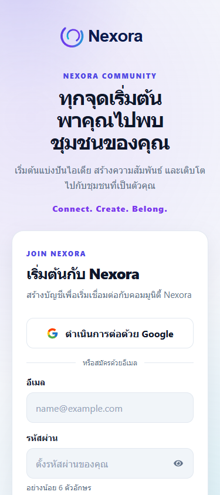
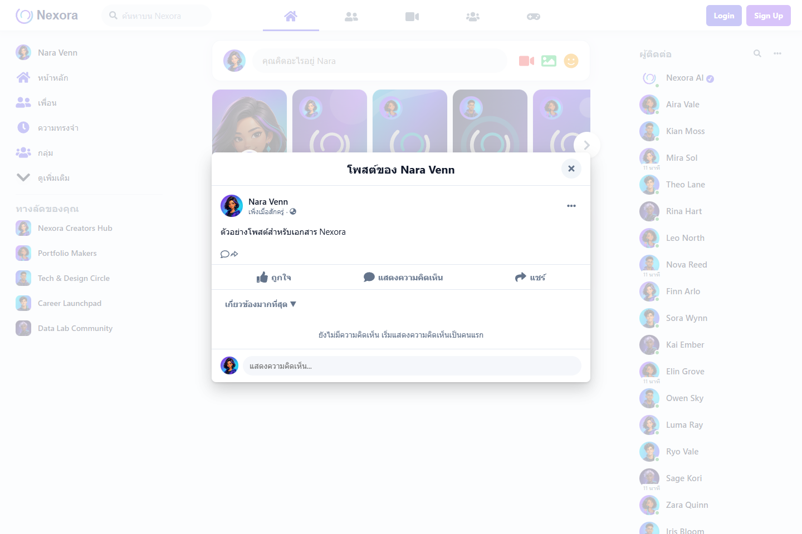
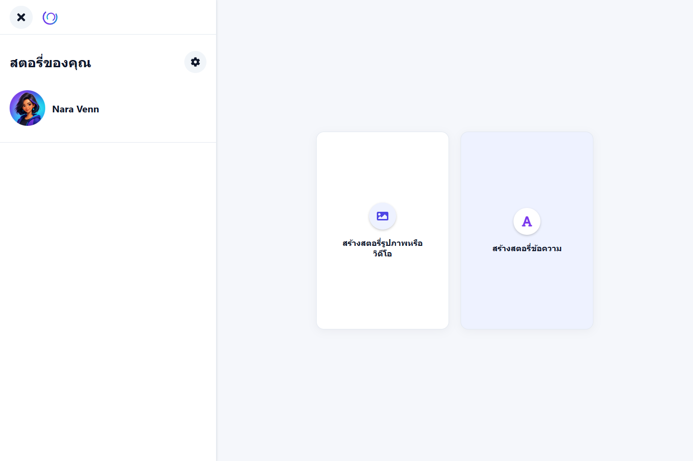
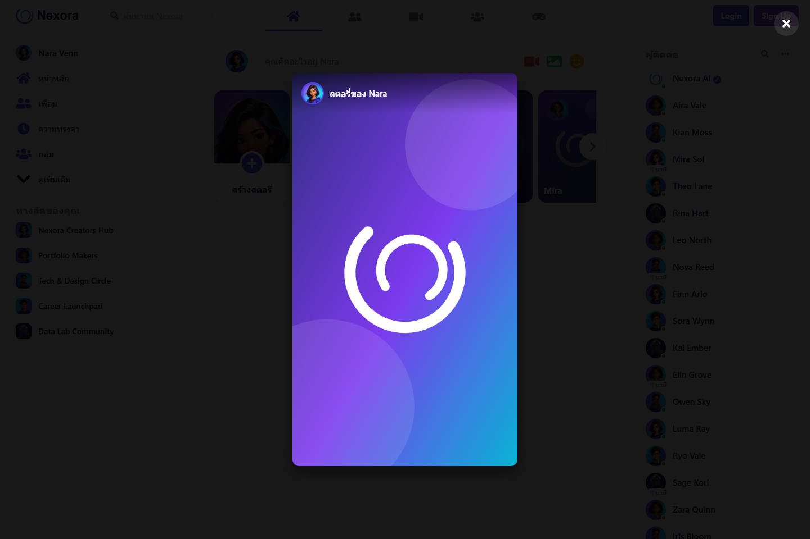

# 4. ฟีเจอร์และคู่มือผู้ใช้

## 1) เริ่มจากหน้า Home

เปิด `/` เพื่อดู Feed เดโม หน้า Home ไม่บังคับให้เข้าสู่ระบบ เพื่อให้ผู้ชม Portfolio ทดลอง UI ได้ทันที

### ค้นหา

พิมพ์คำในช่องค้นหาบน Navbar ระบบจะกรอง:

- ข้อความโพสต์และข้อความของโพสต์ที่แชร์
- รายชื่อผู้ติดต่อ
- ชื่อกลุ่มสนทนา

รองรับภาษาไทยและอังกฤษ, ไม่สนตัวพิมพ์ใหญ่/เล็ก, ตัดช่องว่างต้นท้าย และคืนข้อมูลทั้งหมดเมื่อเคลียร์คำค้นหา Stories, comments และ shortcuts ไม่ได้อยู่ในขอบเขตการค้นหา

### สร้างโพสต์

1. พิมพ์ข้อความใน composer แล้วกด Enter หรือปุ่มสร้างโพสต์
2. เลือกไอคอนรูปภาพหากต้องการแนบไฟล์
3. รูปตัวอย่างจะปรากฏก่อนส่ง และลบออกได้ก่อนสร้าง post

เมื่อสร้างสำเร็จ post ใหม่จะอยู่บนสุดของ Feed การเลือกไฟล์ไม่อัปโหลดขึ้น server; รูปถูกอ่านเป็น Data URL ใน browser session เท่านั้น

### Reaction, comment และ share

- กดปุ่ม Reaction หนึ่งครั้งเพื่อเลือก/ยกเลิก Reaction ปัจจุบัน
- ใช้ mouse hover หรือโฟกัสปุ่มแล้วกดลูกศรลงเพื่อเปิด reaction picker
- กด Escape เพื่อปิด picker
- เปิด post เพื่ออ่านรายละเอียด, เพิ่ม comment และ reply
- เลือกเรียง comment ใน Post Modal ได้ตาม UI ที่มี
- Share Now สร้าง post แบบแชร์ใน Feed เดียวกัน
- Copy Link จะแจ้ง toast ว่ายังไม่พร้อมในเวอร์ชัน Demo เพราะไม่มี route `/posts/:id`

### Stories

- กด Story เดโมเพื่อเปิด viewer
- กดการ์ด “สร้างสตอรี่” เพื่อสร้าง Story ข้อความหรือรูปภาพ
- Story ที่สร้างจะแสดงเฉพาะ session ปัจจุบัน
- Dialog รองรับ Escape, Tab และปุ่มปิด

## 2) Login

เปิด `/login` แล้วเลือกได้สองวิธี:

1. กรอกอีเมลและรหัสผ่านของบัญชี Firebase แล้วกดเข้าสู่ระบบ
2. กด “ดำเนินการต่อด้วย Google” และเลือกบัญชีในหน้าต่าง Google

ฟอร์มมี label ชัดเจน, ปุ่มแสดง/ซ่อนรหัสผ่าน, validation และ loading state หาก Login สำเร็จจะพาไป `/`

## 3) Signup

เปิด `/signup` เพื่อสร้างบัญชีใหม่:

1. สมัครด้วย Google ได้จากปุ่มเดียวกัน; Firebase จะเลือกสร้างบัญชีใหม่หรือเข้าสู่บัญชีเดิมตามบัญชี Google
2. หรือกรอก Email, Password และ Confirm Password
3. Password ต้องยาวอย่างน้อย 6 ตัวอักษรและทั้งสองช่องต้องตรงกัน

หากสำเร็จระบบจะพาไป `/` ทันที ไม่ต้อง Login ซ้ำ

## 4) ปุ่ม Demo

ปุ่มบางส่วนยังไม่มี backend หรือ route รองรับ เช่น menu, notification, contact options และ create group ปุ่มเหล่านี้ถูกทำให้เป็นสถานะ Demo เพื่อไม่ทำให้ผู้ใช้เข้าใจว่าฟีเจอร์ทำงานแล้ว

## 5) การใช้งานด้วยคีย์บอร์ด

| สิ่งที่ทำ | คีย์ |
| --- | --- |
| ส่งข้อความ/คอมเมนต์ | Enter เมื่อไม่ได้อยู่ระหว่าง IME composition |
| เปิด reaction picker | โฟกัสปุ่ม Reaction แล้วกด Arrow Down |
| ปิด picker หรือ dialog | Escape |
| เลื่อน focus ใน dialog | Tab / Shift+Tab |
| แสดง/ซ่อนรหัสผ่าน | Tab ไปที่ปุ่มรูปตา แล้วกด Enter หรือ Space |

## ภาพหน้าต่างฟีเจอร์

| Post Modal | สร้าง Story | ดู Story |
| --- | --- | --- |
|  |  |  |

อ่านต่อ: [Authentication และความปลอดภัย](05-authentication-and-security.md) · [ดีไซน์และ Asset](06-design-assets-and-styles.md)
